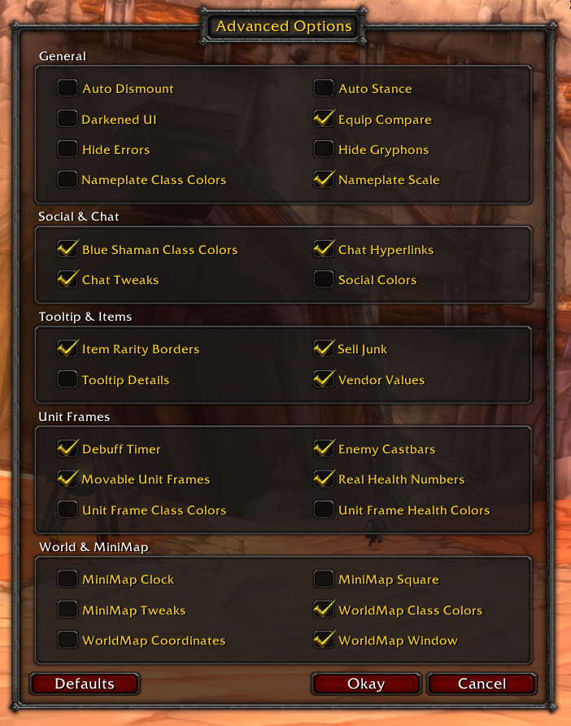

# ShaguTweaks

> **A small World of Warcraft (1.12.1) AddOn for those, who don't want to use any AddOns at all.**

The goal of ShaguTweaks is to be non-intrusive to the default appearance, but also giving the user the choice to change additional settings if desired. The pre-selected defaults of ShaguTweaks only add those quality of life changes to the game, that are preserving the look and feel of the original interface. It's up to everyones own preferences to enable more or even disable some more.

All tweaks are made to the default interface and might not take effect if you already replaced some of the elements with other addons.

All addon settings can be controlled in game via the "Advanced Options" button on the Main Menu (*Esc*).
Every of the listed features below, can be completely disabled in that menu in case you don't like it.

## Installation (Vanilla, 1.12)
1. Download **[Latest Version](https://github.com/shagu/ShaguTweaks/archive/master.zip)**
2. Unpack the Zip file
3. Rename the folder "ShaguTweaks-master" to "ShaguTweaks"
4. Copy "ShaguTweaks" into Wow-Directory\Interface\AddOns
5. Restart Wow

  
*All options enabled, except for squared minimap.*

## Features
- **Auto Dismount**  
  *Automatically dismounts whenever a spell is casted.*

- **Auto Stance**  
  *Automatically switch to the required warrior or druid stance on spell cast.*

- **Blue Shaman Class Colors**  
  *Changes the class color code of shamans to blue, as known from TBC+.*

- **Chat Hyperlinks**  
  *Copy website URLs from the chat, transforms CLINKs into real items and handles quest links.*

- **Chat Tweaks**  
  *Allows to scroll using the mouse wheel, enables sticky chat channels and repeats message on arrow up.*

- **Darkened UI**  
  *Turns the entire interface into darker colors.*

- **Equip Compare**  
  *Shows currently equipped items on tooltips while the shift key is pressed.*

- **Real Health Numbers**  
  *Estimates health numbers, and shows numbers on player, pet and target unit frames.*

- **Item Rarity Borders**  
  *Show item rarity as the border color on bags, bank, character and inspect frames.*

- **Tooltip Details**  
  *Display health, class color, guild name, guild rank and current target on unit tooltips.*

- **MiniMap Clock**  
  *Adds a small 24h clock to the mini map.*

- **MiniMap Square**  
  *Draw the mini map in a squared shape instead of a round one.*

- **MiniMap Tweaks**  
  *Hides unnecessary mini map buttons and allows to zoom using the mouse wheel.*

- **Movable Unit Frames**  
  *Player and Target unit frames can be moved while \<Shift> and \<Ctrl> are pressed together.*

- **Nameplate Class Colors**  
  *Changes the nameplate health bar color to the class color.*

- **Nameplate Scale**  
  *Makes all nameplates honor the UI-Scale setting.*

- **Sell Junk**  
  *Adds a "Sell Junk" button to every merchant window, that sells all grey items.*

- **Social Colors**  
  *Show class colors in Who, Guild, Friends and Chat.*

- **Enemy Castbars**  
  *Shows an enemy castbar on target unit frame.*

- **Debuff Timer**  
  *Show debuff durations on the target unit frame.*

- **Unit Frame Class Colors**  
  *Adds class colors to the player, target and party unit frames.*

- **Vendor Values**  
  *Shows the vendor sell values on all item tooltips.*

- **WorldMap Coordinates**  
  *Adds coordinates to the bottom of the World Map.*

- **WorldMap Window**  
  *Turns the world map into a movable window. The map can be scaled with \<Ctrl> + Mousewheel.*

- **Hide Errors**  
  *Hides and ignores all Lua errors produced by broken addons.*

  
*Target Frame Castbars*

  
*Settings Window*

  
*Debuff Timers & Mob Health*
