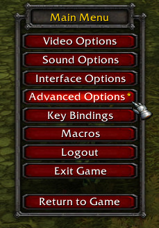
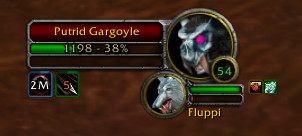
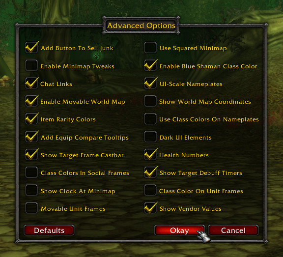

# ShaguTweaks

**A Small World of Warcraft AddOn for all those who don't want to make use of AddOns at all.**

The goal of ShaguTweaks is to be as non-intrusive to the default appearance as possible,
but also giving the user the choice to change additional things if desired.

The pre selected defaults of ShaguTweaks only add quality of life changes to the game, while preserving the look and feel of the original interface. It's up to everyones own preferences to enable more or even disable defaults.

All tweaks are made to the default interface and might not take effect if you already replaced some of the elements with other addons.

The addon settings can be controlled ingame via the "Advanced Options" button on the Main Menu (Esc).
Every of the listed features below can be completely disabled in that menu in case you don't like it.

## Installation (Vanilla, 1.12)
1. Download **[Latest Version](https://github.com/shagu/ShaguTweaks/archive/master.zip)**
2. Unpack the Zip file
3. Rename the folder "ShaguTweaks-master" to "ShaguTweaks"
4. Copy "ShaguTweaks" into Wow-Directory\Interface\AddOns
5. Restart Wow

## Features
- **Blue Shamans Class Colors** - *Changes the class color code of shamans to blue, as it is known from TBC+.*

- **Chat Hyperlinks** - *Allows to copy website URLs from the chat, it transforms CLINKs into real items and can handle quest links.*

- **Darkened UI** - *Turns the entire Interface into dark colors.*

- **Equip Compare**- *Shows currently equipped items on tooltips while the shift key is pressed.*

- **Real Health Numbers** - *Estimates Health Numbers based on the damage dealt, and shows health and mana numbers on player, pet and target unit frames.*

- **Item Rarity Borders** - *Show item rarity as border color on bags, bank, character and inspect frames.*

- **MiniMap Clock** - *Adds a small 24h clock to the mini map.*

- **MiniMap Square** - *Draw the mini map in a squared shape instead of a round one.*

- **MiniMap Tweaks** - *Hides unnecessary mini map buttons and allows to zoom using the mouse wheel.*

- **Movable Unit Frames** - *Player and Target Unit Frames can be moved while <Shift> and <Ctrl> are pressed together.*

- **Nameplate Class Colors** - *Changes the nameplate health bar color to class color of the unit.*

- **Nameplate Scale** - *Makes the nameplates honor the UI-Scale setting, as defined in Video Settings.*

- **Sell Junk** - *Displays a "Sell Junk" button on every merchant window, that allows to sell all grey items with one click.*

- **Social Colors** - *Show class colors in Who, Guild, Friends and Chat.*

- **Enemy Castbars** - *Shows a enemy castbar on target unit frame.*

- **Debuff Timer** - *Show debuff duration timers on the target unit frame.*

- **Unit Frame Class Colors** - *Adds class colors to the player, target and party unit frames.*

- **Vendor Values** - *Shows the vendor sell values on all item tooltips.*

- **WorldMap Coordinates** - *Adds Coordinates to the bottom of the World Map.*

- **WorldMap Window** - *Turns the world map into a movable window. The map can be scaled with <Ctrl> + Mousewheel.*

## Screenshots
  
*All options enabled, except for squared minimap.*

  
*Debuff Timers & Mob Health*

  
*Target Frame Castbars*

  
*Settings Window*
